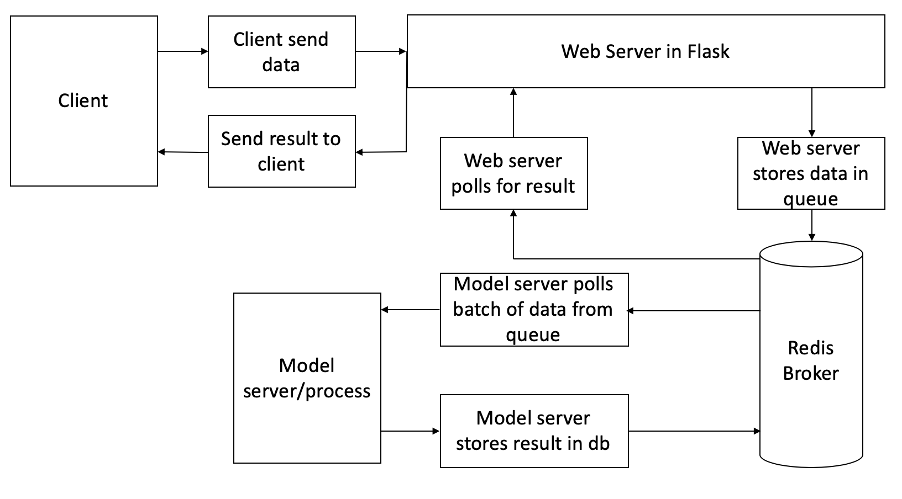

# DocDocEyes

## Medical diagnostics with Artificial Intelligence
DocDocEyes was my first start-up project. The goal of DocDocEyes was to detect cancer on medical imagery.
On this repository you will find our architecture and the model we used (**only the.h5 file contact me for the full code**)

### Our model can detect skin and breast cancer.

**The project was abandoned due to the lack of traction.**
